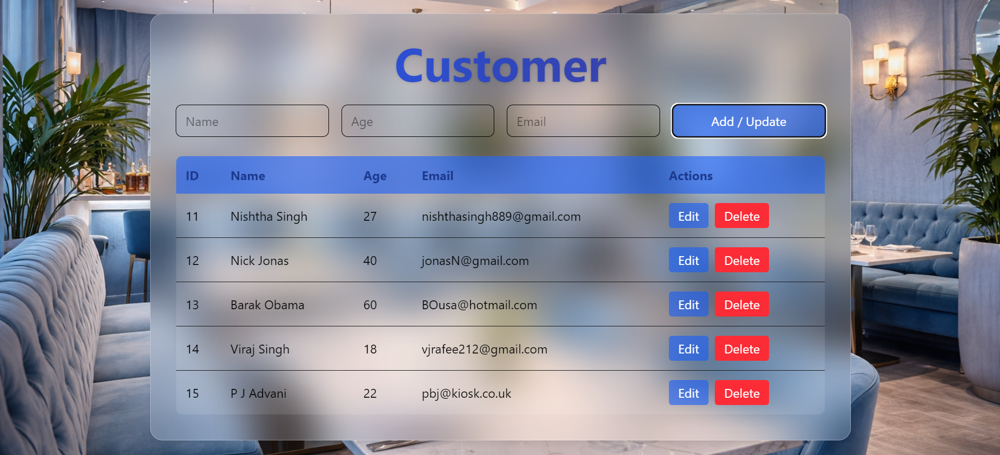

# Customer CRUD App

## Overview

Simple full-stack application to manage customers with create, read, update, and delete operations. Data is stored in a MySQL database and accessed through a Spring Boot backend with a lightweight frontend using HTML and JavaScript.

## Screenshot



---

## Tech Stack

* Java, Spring Boot Framework
* HTML, JavaScript, Tailwind CSS
* MySQL

---

## Reflection

### Familiar

I have worked with Java, Spring Boot, REST APIs, and MySQL in projects I did during my MSc. So, I could set up the backend and design the CRUD APIs efficiently.

### New

Building both frontend & backend of the application individually and integrating them was a new experience. I got to use postman to test the APIs. Moreover, I used MySQL workbench to visualise the changes in database.

### Learning

This project helped me understand the complete end-to-end flow of a full-stack application, from UI interactions to backend processing and database persistence.
I also improved my ability to build and structure a working application within a limited time constraint, focusing on functionality and validation.

---

## How to Run

1. Configure MySQL in `application.properties`
2. Run backend:

```
mvn spring-boot:run
```

3. Open:

```
http://localhost:8080/index.html
```

---
