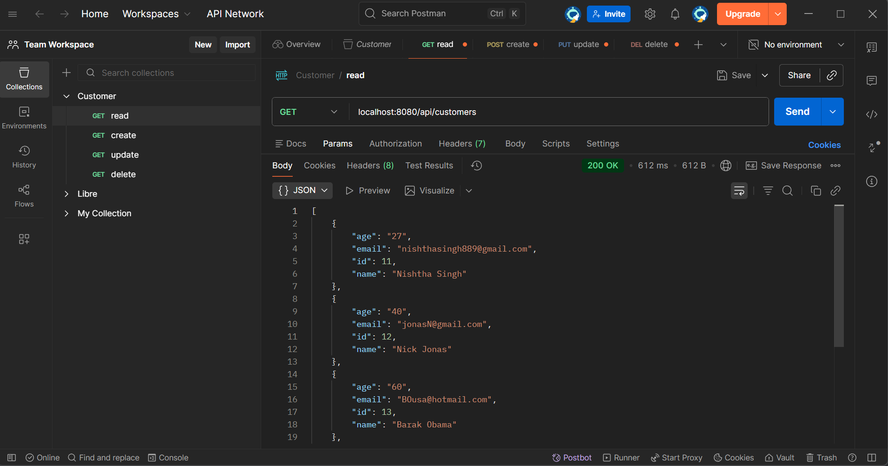
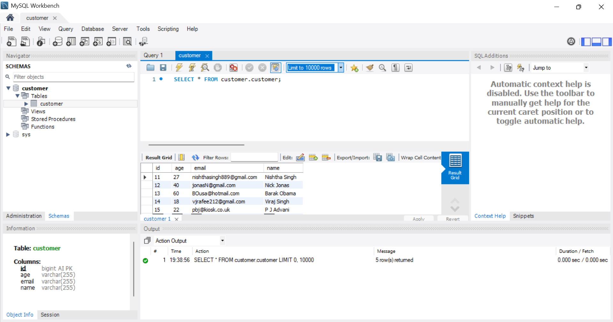

# Customer CRUD App

## Overview

Simple full-stack application to manage customers with create, read, update, and delete operations. Data is stored in a MySQL database and accessed through a Spring Boot backend with a lightweight frontend using HTML and JavaScript.

## Screenshot


---

## Tech Stack

* Backend: Java, Spring Boot Framework
* Frontend:HTML, JavaScript(Fetch API), Tailwind CSS
* Database: MySQL

---

## Reflection

### Familiar

I have worked with Java, Spring Boot, REST APIs, and MySQL in projects I did during my MSc. So, I could set up the backend and design the CRUD APIs efficiently.

### New

Building both frontend & backend of the application individually and integrating them was a new experience. I got to use postman to test the APIs. Moreover, I used MySQL workbench to visualise the changes in database.

### Learning

This project helped me understand the complete end-to-end flow of a full-stack application, from UI interactions to backend processing and database persistence.
I also improved my ability to build and structure a working application within a limited time constraint, focusing on functionality and validation.

---
## Testing

### API Testing (Postman)

All backend endpoints were tested using Postman to ensure correct functionality:

* GET `/api/customers` – verified that all customers are returned
* POST `/api/customers` – confirmed new customers can be created
* PUT `/api/customers/{id}` – verified updates are applied correctly
* DELETE `/api/customers/{id}` – confirmed records are removed

Both valid and invalid inputs were tested to check input handling and response behaviour.

## Postman 


---

### Database Testing (MySQL)

The MySQL database was checked directly to confirm data persistence:

* New entries were successfully stored in the database
* Updates were reflected correctly in existing records
* Deleted entries were permanently removed

This confirmed that all CRUD operations are properly integrated with the database.


## MySQL


## How to Run
Prerequisites: Java 17, MySQL, Maven.
1. Update your MySQL configuration in application properties with your local database credentials.
2. Start the Spring Boot application using the command:

```
mvn spring-boot:run
```

3. Once the server starts successfully, open the application in your browser:

```
http://localhost:8080/index.html
```

---
